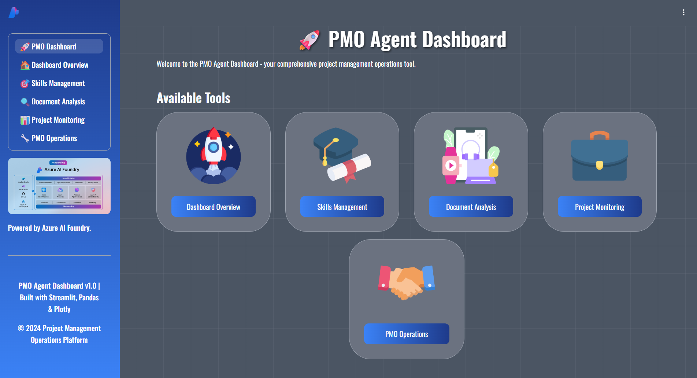

## 🛠️ Technology Stack

- **Frontend:** Streamlit 1.50.0 (Python-based web application framework)
- **UI Styling:** Custom CSS with Google Fonts (Gasoek One, Oswald)
- **Data Processing:** Pandas 2.3.3, Plotly 6.3.1
- **AI Integration:** OpenAI 2.3.0 API support
- **Azure Services:** 
  - Azure AI Document Intelligence (document extraction)
  - Azure Cosmos DB (data storage)
  - Azure Identity (authentication)
- **Visualization:** Plotly Express, Plotly Graph Objects
- **Package Management:** uv + pyproject.toml (modern Python tooling)
- **Build System:** Hatchling

## 📋 Prerequisites

- Python 3.11 or higher
- uv (modern Python package installer) or pip

## 🔧 Installation

1. Clone the repository:
```bash
git clone https://github.com/robrita/azdemo.git
cd azdemo
```

2. Install required dependencies:

### Using uv (Recommended - Modern & Fast)
```bash
uv sync
```

### Using pip (Traditional)
```bash
pip install streamlit==1.50.0 pandas==2.3.3 plotly==6.3.1 openai==2.3.0
```

3. Set up environment variables:
Create a `.env` file in the root directory (see `.env.example` for template):
```bash
# Azure Document Intelligence
AZURE_DOCUMENT_INTELLIGENCE_ENDPOINT=https://your-resource.cognitiveservices.azure.com/
AZURE_DOCUMENT_INTELLIGENCE_KEY=your-key-here
AZURE_DOCUMENT_INTELLIGENCE_MODEL_ID=prebuilt-invoice

# Azure Cosmos DB
AZURE_COSMOS_ENDPOINT=https://your-cosmos-account.documents.azure.com:443/
AZURE_COSMOS_DATABASE=your-database-name

# OpenAI (Optional)
OPENAI_API_KEY=your_api_key_here
```

**See [DOCUMENT_INTELLIGENCE_SETUP.md](DOCUMENT_INTELLIGENCE_SETUP.md) for detailed Azure setup instructions.**

## 🚀 Usage

Run the Streamlit application:

### Using uv (Recommended)
```bash
uv run streamlit run app.py
```

### Using pip/system Python
```bash
streamlit run app.py
```

The application will open in your default web browser at `http://localhost:8501`

## 🛠️ Dependency Management

This project uses modern Python packaging standards with `pyproject.toml`:

### Core Dependencies
- **streamlit==1.50.0** - Web application framework
- **pandas==2.3.3** - Data manipulation and analysis
- **plotly==6.3.1** - Interactive visualizations
- **openai==2.3.0** - AI/LLM integration
- **azure-ai-documentintelligence>=1.0.2** - Document extraction
- **azure-cosmos>=4.9.0** - Azure Cosmos DB client
- **azure-identity>=1.25.1** - Azure authentication
- **python-dotenv** - Environment variable management

### Key Commands with pyproject.toml

```bash
# Install all dependencies (recommended)
uv sync

# Add a new dependency
uv add package_name

# Add a development dependency
uv add --dev package_name

# Remove a dependency
uv remove package_name

# Update dependencies
uv sync --upgrade

# Run the application
uv run streamlit run app.py

# Run Python scripts
uv run python script.py

# Install from lock file (for deployment)
uv sync --frozen
```

### Why pyproject.toml + uv?

✅ **Modern Standard**: Follows PEP 518/621 Python packaging standards  
✅ **Faster**: 10-100x faster dependency resolution than pip  
✅ **Reproducible**: Lock file ensures identical environments  
✅ **Simpler**: All project configuration in one file  
✅ **Better UX**: Clear error messages and progress indicators

## 🚀 Deployment

### Quick Start (Development)
```bash
uv run streamlit run app.py
```

### Production Deployment
```bash
# Install production dependencies
uv sync --frozen

# Run with production settings
uv run streamlit run app.py --server.port 8080 --server.address 0.0.0.0
```

### Docker Deployment
```dockerfile
FROM python:3.11-slim
WORKDIR /app
COPY . .
RUN pip install uv
RUN uv sync --frozen
EXPOSE 8080
CMD ["uv", "run", "streamlit", "run", "app.py", "--server.port", "8080", "--server.address", "0.0.0.0"]
```

## 🔒 Security

- Environment variables for sensitive data
- No hardcoded credentials
- Secure file upload handling
- Input validation

## 🤝 Contributing

Contributions are welcome! Please feel free to submit a Pull Request.

## 📝 License

This project is open source and available under the MIT License.

## 📧 Support

For support, please open an issue in the GitHub repository.

## 🙏 Acknowledgments

- Built with [Streamlit](https://streamlit.io/)
- Charts powered by [Plotly](https://plotly.com/)
- Data processing with [Pandas](https://pandas.pydata.org/)
- Icons and fonts from [Google Fonts](https://fonts.google.com/)